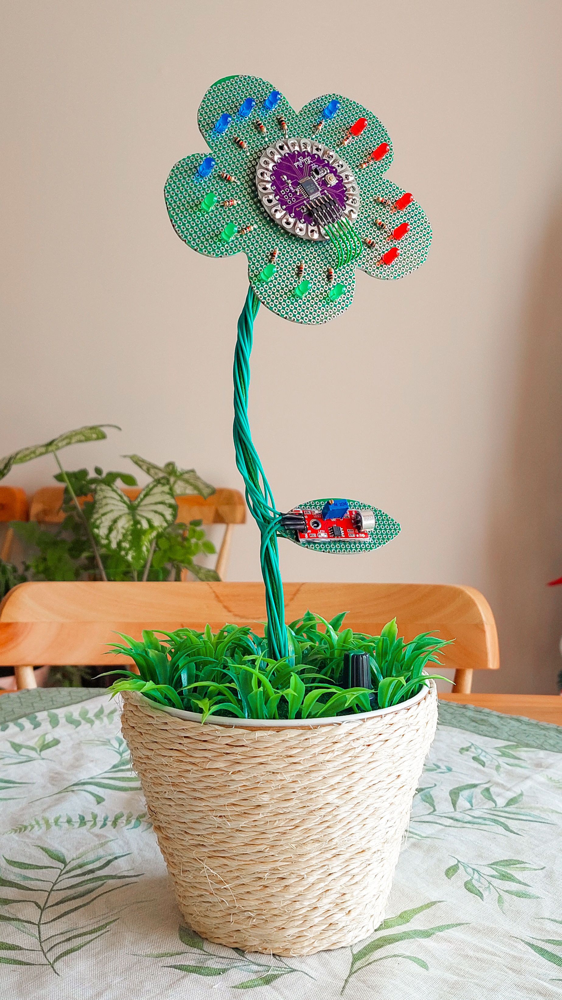
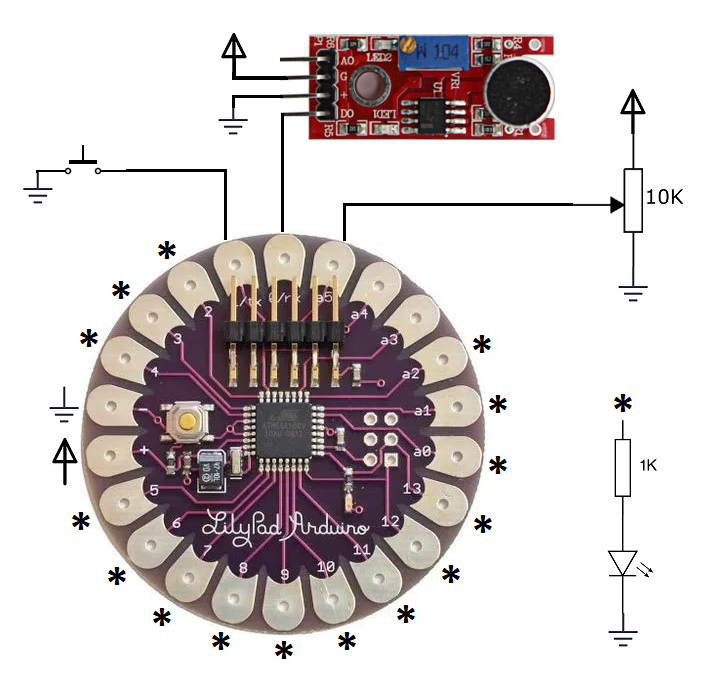

# Arduino Flower-Shaped Electronic Project

## Overview
This project is a creative implementation of an Arduino-based electronic circuit, designed in the shape of a flower. It's not just an electronic device but also a decorative gift. The project uses an Arduino Lilypad, 15 1K resistors, 15 LEDs, a push button, a sound sensor module (KY 037), and a 10K potentiometer.

Click on the image below to see a video demonstration of the project:

## Features
- **Shape and Structure:** The project is built on a perforated board cut into the shape of a flower with five petals, each petal containing 3 LEDs, forming a circle around the central Arduino.
- **Support and Base:** A rigid green wire supports the flower-like circuit board, which is fixed in a pot resembling a flower pot. The top surface of the pot is covered with a green fabric and plastic grass to simulate soil and grass.
- **Leaf-Shaped Sound Sensor:** A circuit board shaped like a leaf contains the KY 037 sound sensor.
- **Interactive Modes:**
  1. Spinning LED effect.
  2. Random LED blinking.
  3. LEDs respond to ambient sound, lighting up in sync with the sound detected.
- **Control Mechanism:** The modes can be switched using a push button at the base, and the speed of the modes is controlled by a rotary button (potentiometer).

## Gallery
Here are a few pictures showcasing key features and components of the project.
(wip)

## Circuit Design
Here is an image of the circuit for those who are interested in the construction details: 

## Usage
- **Switching Modes:** Press the push button to switch between the different LED modes.
- **Adjusting Speed:** Use the rotary button to control the speed of the LED effects.

---
###
I hope you find this project as enjoyable to see as it was for me to create.

